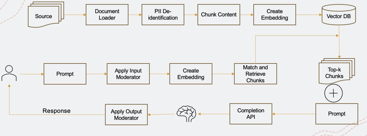

# Retrieval-Augmented Generation: The Definitive Guide

## Table of Contents

- [**1. Introduction**](#1-introduction)
    - [1.1 Background of Generative Models](#11-background-of-generative-models)
    - [1.2 The Rise of Retrieval Systems](#12-the-rise-of-retrieval-systems)
- [**2. Foundations of RAG**](#2-foundations-of-rag)
    - [2.1 What are the solution archetypes for building language model applications?](#21-what-is-retrieval-augmented-generation)
    - [2.2 What is Retrieval-Augmented Generation?](#21-what-is-retrieval-augmented-generation)
    - [2.3 Key Components of RAG](#22-key-components-of-rag)
- [**3. Deep Dive: Retrieval Mechanisms**](#3-deep-dive-retrieval-mechanisms)
    - [3.1 Traditional Retrieval Systems](#31-traditional-retrieval-systems)
    - [3.2 Neural Retrieval Methods](#32-neural-retrieval-methods)
    - [3.3 Evaluating Retrieval Effectiveness](#33-evaluating-retrieval-effectiveness)
- [**4. Deep Dive: Generative Processes**](#4-deep-dive-generative-processes)
    - [4.1 Basics of Generative Models](#41-basics-of-generative-models)
    - [4.2 Incorporating Retrieved Information](#42-incorporating-retrieved-information)
    - [4.3 Challenges in Generation](#43-challenges-in-generation)
- [**5. Applications of RAG**](#5-applications-of-rag)
    - [5.1 Question Answering Systems](#51-question-answering-systems)
    - [5.2 Content Creation and Summarization](#52-content-creation-and-summarization)
    - [5.3 Personalized Recommendations](#53-personalized-recommendations)
- [**6. Training and Fine-tuning RAG Models**](#6-training-and-fine-tuning-rag-models)
    - [6.1 Data Requirements](#61-data-requirements)
    - [6.2 Model Architectures and Choices](#62-model-architectures-and-choices)
    - [6.3 Best Practices in Training](#63-best-practices-in-training)
- [**7. Ethical Considerations and Challenges**](#7-ethical-considerations-and-challenges)
    - [7.1 Bias in Retrieval and Generation](#71-bias-in-retrieval-and-generation)
    - [7.2 Ensuring Information Authenticity](#72-ensuring-information-authenticity)
    - [7.3 Ethical Use Cases and Limitations](#73-ethical-use-cases-and-limitations)
- [**8. Future of Retrieval-Augmented Generation**](#8-future-of-retrieval-augmented-generation)
    - [8.1 Advancements on the Horizon](#81-advancements-on-the-horizon)
    - [8.2 Potential Impact on Industries](#82-potential-impact-on-industries)
    - [8.3 The Road Ahead](#83-the-road-ahead)
- [**9. Conclusion**](#9-conclusion)
- [**10. Appendices**](#10-appendices)
    - [A. Glossary of Terms](#a-glossary-of-terms)
    - [B. Resources and Further Reading](#b-resources-and-further-reading)
- [**11. References**](#11-references)

## 1.1 Background of Generative Models

Generative models have become a cornerstone in the world of machine learning and artificial intelligence. Their primary goal is to generate new data samples that are similar to the input data. Let's delve into the history and evolution of these models.

### A Brief History

- **Early Beginnings**: The concept of generating data isn't new. Simple linear models, like regression, can be seen as the earliest forms of generative models, predicting outputs based on inputs.
  
- **Neural Networks Era**: With the advent of neural networks in the 1980s and 1990s, the capacity to generate more complex data patterns became possible. However, the real potential of neural networks remained untapped due to computational limitations and lack of large datasets.

- **Deep Learning Revolution**: The 2010s saw a resurgence in neural networks, now termed "deep learning". With advancements in computational power and the availability of large datasets, models like Generative Adversarial Networks (GANs) and Variational Autoencoders (VAEs) emerged, pushing the boundaries of what was possible in data generation.

### Key Concepts in Generative Models

- **Probability Distributions**: At their core, generative models aim to learn the probability distribution of the input data. Once this distribution is learned, new data samples can be drawn from it.

- **Latent Space**: Generative models often represent data in a compressed form known as the latent space. This space captures the essential features of the data, allowing for the generation of new, similar samples.

- **Generative vs. Discriminative Models**: While generative models aim to reproduce the data distribution, discriminative models focus on distinguishing between different data classes. The combination of both has led to powerful models like GANs, where a generator creates data and a discriminator evaluates its authenticity.

### Popular Generative Models

- **Generative Adversarial Networks (GANs)**: Introduced by Ian Goodfellow in 2014, GANs consist of a generator and a discriminator that work in tandem. The generator produces data samples, and the discriminator evaluates them. The process is akin to a forger trying to create a painting, while an art detective tries to detect its authenticity.

- **Variational Autoencoders (VAEs)**: VAEs are a type of autoencoder that produces a probabilistic encoding of the input data. They are particularly useful in tasks like image denoising and inpainting.

- **Recurrent Neural Networks (RNNs)**: While primarily used for sequence data, RNNs, especially their advanced versions like LSTM and GRU, have been employed for generative tasks, especially in text and music generation.

## 1.2 Rise of Retrieval Systems

Retrieval systems, often synonymous with search engines in the digital realm, have become an integral part of our daily lives. From searching for information on the web to looking up a song in a music library, retrieval systems power these interactions. Let's explore the ascent of these systems over the years.

### The Early Days

- **Library Catalogs**: Before the digital age, retrieval systems existed in the form of library card catalogs. These manual systems allowed users to locate books based on author, title, or subject.

- **Database Management**: With the advent of computers, early database management systems provided simple query capabilities, enabling users to retrieve specific records from large datasets.

### The Digital Revolution

- **Web Search Engines**: The explosion of the World Wide Web in the 1990s necessitated the creation of search engines. Early players like AltaVista, Lycos, and Yahoo! paved the way for the dominance of Google, which revolutionized retrieval with its PageRank algorithm.

- **Personalized Search**: As the internet grew, so did the desire for personalized experiences. Retrieval systems began to incorporate user preferences, search history, and other personalized data to deliver more relevant results.

### Advanced Retrieval Techniques

- **Semantic Search**: Instead of merely matching keywords, semantic search aims to understand the intent and contextual meaning of a query. This has led to more accurate and relevant search results.

- **Recommendation Systems**: Platforms like Netflix, Spotify, and Amazon employ sophisticated retrieval systems to recommend movies, songs, or products based on user behavior and preferences.

- **Voice Search & Assistants**: With the rise of smart speakers and virtual assistants like Siri, Alexa, and Google Assistant, voice-based retrieval systems have gained prominence. These systems need to understand and process natural language queries spoken by users.

### The Role of AI and Machine Learning

- **Deep Learning**: Neural networks, especially deep learning models, have enhanced the capabilities of retrieval systems. They can process vast amounts of data, understand intricate patterns, and deliver more accurate results.

- **BERT and Transformers**: Models like BERT (Bidirectional Encoder Representations from Transformers) have revolutionized the way retrieval systems understand and process language, making them more context-aware and efficient.

### Looking Ahead

The future of retrieval systems lies in their ability to understand not just the explicit query of the user, but also the implicit needs, emotions, and contexts. With advancements in AI, augmented reality, and other technologies, the next generation of retrieval systems will be more intuitive, anticipatory, and immersive.

## 2.1 Solution Archetypes for Building LLM Applications

Building applications with Large Language Models (LLMs) requires a strategic approach. Depending on the specific needs, resources, and goals of the project, organizations can choose from several solution archetypes. This section delves into three primary archetypes: Retrieval-Augmented Generation (RAG), Fine-tuning, and Building Language Models from Scratch.

### Retrieval-Augmented Generation (RAG)

RAG combines the best of retrieval and generation systems, offering a hybrid approach that leverages the strengths of both.

- **How it Works**: RAG uses a retriever to fetch relevant documents or passages from a large corpus and then employs a generator to produce a coherent response based on the retrieved content.
  
- **Advantages**:
  - **Scalability**: Can handle vast amounts of data by retrieving only relevant portions.
  - **Flexibility**: Combines the precision of retrieval with the fluency of generation.
  
- **Use Cases**: Ideal for applications where context from large datasets is crucial, such as question-answering systems or research assistants.

### Fine-tuning

Fine-tuning involves taking a pre-trained language model and refining it on a specific dataset or for a particular task.

- **How it Works**: Start with a model trained on a vast corpus. Then, train it further on a narrower dataset or with task-specific data to adapt its knowledge.
  
- **Advantages**:
  - **Efficiency**: Utilizes the foundational knowledge of the pre-trained model, reducing training time and data requirements.
  - **Customization**: Tailors the model to specific domains or tasks.
  
- **Use Cases**: Perfect for domain-specific applications, such as medical chatbots or legal document analysis, where general language models might lack depth.

### Building Language Models from Scratch

For those with ample resources and specific needs, building a language model from the ground up is an option.

- **How it Works**: Instead of starting with a pre-trained model, organizations collect and preprocess their dataset, design the neural network architecture, and train the model from scratch.
  
- **Advantages**:
  - **Full Control**: Organizations have complete control over the data, architecture, and training process.
  - **Unique Capabilities**: Can cater to very niche requirements that off-the-shelf models might not address.
  
- **Challenges**:
  - **Resource Intensive**: Requires significant computational power and data.
  - **Time-Consuming**: Training a large model from scratch can take a considerable amount of time.
  
- **Use Cases**: Suitable for organizations with specific and unique data needs, where existing models don't suffice.

---

Each of these archetypes offers distinct advantages and is suited for different scenarios. The choice between them depends on the specific requirements of the application, the available resources, and the desired outcome.

## Retrieval-Augmented Generation (RAG)

Retrieval-Augmented Generation, commonly referred to as RAG, represents a paradigm shift in the world of natural language processing. It combines the strengths of both retrieval-based and generation-based approaches to produce more informed and contextually relevant responses.

### What is RAG?

At its core, RAG is a hybrid model that integrates a retrieval system with a generative model. Instead of generating responses purely based on a pre-trained model's internal knowledge, RAG first retrieves relevant documents or passages from a vast corpus and then uses this retrieved information to generate a coherent and contextually appropriate response.

### How Does RAG Work?

1. **Retrieval Phase**: When presented with a query, the RAG system first employs a retriever (often based on dense vector representations) to fetch the most relevant passages or documents from a predefined corpus.

2. **Generation Phase**: Once the relevant passages are retrieved, they are provided as context to a generative model, which then crafts a response that incorporates information from these passages.

### Advantages of RAG:

- **Contextual Relevance**: By leveraging external knowledge from a corpus, RAG can provide answers that are more contextually grounded and detailed.
  
- **Scalability**: RAG can effectively handle vast amounts of data by retrieving and focusing only on the most pertinent portions for any given query.
  
- **Flexibility**: It combines the precision of retrieval systems with the fluency and adaptability of generative models.

### Applications of RAG:

RAG has shown promise in a variety of applications, including:

- **Question Answering Systems**: Especially in open-domain settings where answers can come from a wide range of sources.
  
- **Research Assistants**: Assisting researchers by pulling relevant information from vast academic corpora.
  
- **Conversational Agents**: Enhancing chatbots by providing them with the ability to pull in real-time information from external sources.

Retrieval-Augmented Generation is a testament to the evolving landscape of AI and NLP. By marrying retrieval and generation, RAG offers a powerful tool that can harness vast external knowledge bases to produce richer, more informed outputs. As the field progresses, we can expect RAG and similar models to play a pivotal role in shaping the future of information retrieval and natural language generation.

## Key Components of Retrieval-Augmented Generation (RAG)

Retrieval-Augmented Generation (RAG) is a sophisticated approach in natural language processing that merges the capabilities of retrieval systems with generative models. To understand RAG in depth, it's crucial to break down its main components: extraction, data preprocessing, retrieval, and generation.

### 1. Extraction

Extraction is the initial step of identifying and extracting relevant information from a myriad of sources.

- **Purpose**: To transform vast amounts of structured and unstructured data into a more manageable and usable format.
  
- **Methods**:
  - **Parsers**: Tools and libraries designed to parse various formats like HTML, PDF, XML, and more.
  - **Web Scraping**: Techniques to extract data from web pages.
  - **Database Queries**: Extracting structured data from databases.
  
- **Outcome**: Raw data from various sources, ready for preprocessing.

### 2. Data Preprocessing

Once data is extracted, it undergoes preprocessing to ensure it's in the best format for retrieval and generation.

- **Purpose**: To refine and structure the raw data, making it suitable for the subsequent stages of RAG.
  
- **Methods**:
  - **Chunking**: Breaking down large texts into smaller, more manageable pieces.
  - **PII De-identification**: Removing or anonymizing personally identifiable information to ensure data privacy.
  - **Creation of Embeddings**: Transforming text data into numerical vectors using techniques like word embeddings or transformer-based embeddings.
  - **Storing into Vector Databases**: Efficiently storing and indexing the embeddings for quick retrieval.
  
- **Outcome**: Processed and structured data, optimized for retrieval and generation.

### 3. Retrieval

Retrieval is about fetching the most relevant documents or passages from a corpus based on a given query.

- **Purpose**: To quickly and accurately pull the most pertinent information from a vast dataset.
  
- **Methods**:
  - **Sparse Retrieval**: Uses traditional information retrieval techniques, like TF-IDF or BM25.
  - **Dense Retrieval**: Employs dense vector representations to capture semantic meanings.
  - **Hybrid Retrieval**: Combines both sparse and dense methods for enhanced performance.

- **Outcome**: A set of documents or passages that are most likely to contain the answer or context for the given query.

### 4. Generation

With the relevant information retrieved, the generation component crafts a coherent and contextually appropriate response.

- **Purpose**: To produce fluent, coherent, and contextually relevant responses based on both the original query and the retrieved information.
  
- **Methods**:
  - **Seq2Seq Models**: Models like transformers that convert a sequence of input tokens (query + retrieved passages) into a sequence of output tokens (response).
  - **Fine-tuning**: Adapting pre-trained models to specific tasks or domains to enhance performance.
  
- **Outcome**: A well-formed response that addresses the query, informed by the retrieved passages.

The intricate dance between extraction, preprocessing, retrieval, and generation in RAG offers a powerful mechanism to harness vast external knowledge bases for richer, more informed outputs. By understanding each component's role and function, we can appreciate the intricacies and potential of Retrieval-Augmented Generation as a game-changer in the realm of natural language processing.

# Retrieval-Augmented Generation Process

